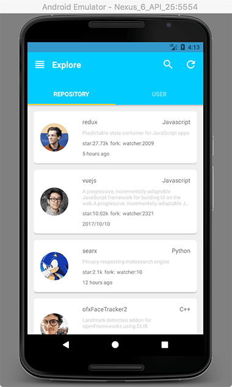
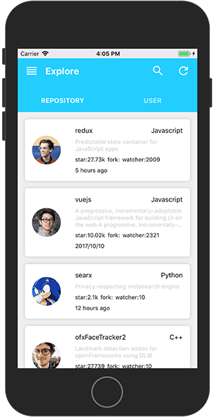
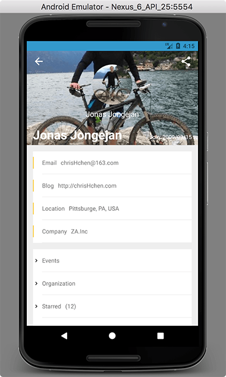

# github-react-native

This is a practice project simulating an native android app called [**Github**](http://shouji.baidu.com/software/11354794.html) , which can be found on android app market.

Many thanks to author **seasonfif**

Feel free to clone this repo.  try whatever you want with it

## Screenshot

